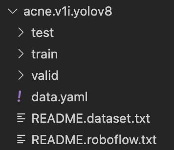

# Acne - Detector

## Installation
```
conda create -n acne-detector python=3.11
```

```
conda activate acne-detector
```

```
pip install -r requirements.txt
```

## Object Detection Workshop
1. First import the yolov8 from ultralytics
2. play the model with image or video
3. use the webcam to inference

To learn more, visit the below websites:
- Documents: https://docs.ultralytics.com
- Github: https://github.com/ultralytics/ultralytics
- Arguements for prediction: https://docs.ultralytics.com/modes/predict/#inference-arguments

## Train Custom Model
The only thing you need to do is to change the `yml_path` of your dataset.

Make sure you have the dataset as the below format:


